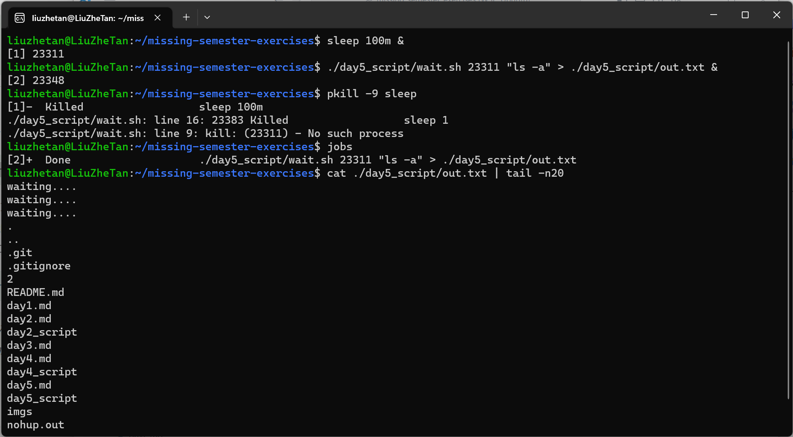

# 命令行环境

## 任务控制

1. 我们可以使用类似 ps aux | grep 这样的命令来获取任务的 pid ，然后您可以基于pid 来结束这些进程。但我们其实有更好的方法来做这件事。在终端中执行 sleep 10000 这个任务。然后用 Ctrl-Z 将其切换到后台并使用 bg来继续允许它。现在，使用 pgrep 来查找 pid 并使用 pkill 结束进程而不需要手动输入pid。(提示：: 使用 -af 标记)。

    ```shell
    # 多创建几个sleep进程
    sleep 1000
    # 显示所有的sleep进程
    $pgrep sleep
    # 删除所有的sleep进程
    pkill -9 -f sleep
    ```

    

2. 如果您希望某个进程结束后再开始另外一个进程， 应该如何实现呢？在这个练习中，我们使用 sleep 60 & 作为先执行的程序。一种方法是使用 wait 命令。尝试启动这个休眠命令，然后待其结束后再执行 ls 命令。但是，如果我们在不同的 bash 会话中进行操作，则上述方法就不起作用了。因为 wait 只能对子进程起作用。之前我们没有提过的一个特性是，kill 命令成功退出时其状态码为 0 ，其他状态则是非0。kill -0 则不会发送信号，但是会在进程不存在时返回一个不为0的状态码。请编写一个 bash 函数 pidwait ，它接受一个 pid 作为输入参数，然后一直等待直到该进程结束。您需要使用 sleep 来避免浪费 CPU 性能。

    >脚本“./day5_script/wait.sh”接收两个参数，第一个是需要等到的进程的pid，第二个是要启动的命令或脚本(使用eval命令启动)。

    创建一个sleep进程然后执行"ls -a"程序，将输出重定向到"day5_script/out.txt"文件中。

    

## 终端多路复用

1. 请完成这个 tmux 教程 参考这些步骤来学习如何自定义 tmux。

## 别名

1. 创建一个 dc 别名，它的功能是当我们错误的将 cd 输入为 dc 时也能正确执行。
2. 执行 history | awk '{$1="";print substr($0,2)}' | sort | uniq -c | sort -n | tail -n 10 来获取您最常用的十条命令，尝试为它们创建别名。注意：这个命令只在 Bash 中生效，如果您使用 ZSH，使用history 1 替换 history。

    ```shell
    # 创建dc别名
    alias dc=cd
    # 创建comm别名,注意$和“要使用转义符
    alias comm="history | awk '{\$1=\"\";print substr(\$0,2)}' | sort | uniq -c | sort -n | tail -n 10"
    ```

    

## 配置文件

1. 为您的配置文件新建一个文件夹，并设置好版本控制
2. 在其中添加至少一个配置文件，比如说您的 shell，在其中包含一些自定义设置（可以从设置 $PS1 开始）。
3. 建立一种在新设备进行快速安装配置的方法（无需手动操作）。最简单的方法是写一个 shell 脚本对每个文件使用 ln -s，也可以使用专用工具
4. 在新的虚拟机上测试该安装脚本。
5. 将您现有的所有配置文件移动到项目仓库里。
6. 将项目发布到GitHub。

使用chezmoi工具实现dotfile管理，参考[文档](https://www.chezmoi.io/quick-start/#start-using-chezmoi-on-your-current-machine)

1. 初始化并，添加~/.vimrc文件使用chezmoi对其修改

    ```shell
    chezmoi init
    chezmoi add ~/.vimrc
    chezmoi edit ~/.vimrc
    chezmoi diff
    ```

    

2. 将chezmoi存储的文件上传github

    ```shell
    chezmoi cd
    git init
    git remote add origin YOUR RESPOSITY
    git pull origin main
    git add .
    git commit -m"Initial commit"
    git push -u origin main
    ```

    

3. 在新机器上从远程仓库初始化

    ```shell
    chezmoi init https://github.com/$GITHUB_USERNAME/dotfiles.git
    chezmoi apply -v
    ```

## 远端设备

进行下面的练习需要您先安装一个 Linux 虚拟机（如果已经安装过则可以直接使用），如果您对虚拟机尚不熟悉，可以参考这篇教程 来进行安装。

由于硬盘空间不是很足（~~懒得清理空间~~），就不另外创建一个虚拟机了，使用WSL作为SSH服务器，在Windows Powershell上使用SSH远程登陆。

首先在WSL上安装ssh-server，参考[这篇文章](https://www.cnblogs.com/conefirst/articles/15225952.html)。关于Windows访问WSL网络，参考[这里](https://learn.microsoft.com/zh-cn/windows/wsl/networking#accessing-linux-networking-apps-from-windows-localhost)。最后在Windows上使用密钥登陆参考[这里](https://learn.microsoft.com/zh-cn/windows-server/administration/openssh/openssh_keymanagement)

1. 请使用ssh-keygen -o -a 100 -t ed25519创建一个密钥
2. 使用scp将公钥部署到服务器上

    ```PowerSehll
    scp C:\Users\username\.ssh\id_ed25519.pub user1@domain1@contoso.com:C:\Users\username\.ssh\authorized_keys
    ```

    
3. 在Windows配置.ssh/config:

    >Host vm \
    User [YourUserName] \
    HostName localhost \
    IdentityFile ~/.ssh/id_ed25519 \
    LocalForward 9999 localhost:8888
4. 启动在WSL的8888端口启动web服务器，在本地以及通过<http://localhost:9999/>访问

    

    

使用sudo vim /etc/ssh/sshd_config 编辑 SSH 服务器配置，通过修改PasswordAuthentication的值来禁用密码验证。通过修改PermitRootLogin的值来禁用 root 登录。然后使用sudo service sshd restart重启 ssh 服务器，然后重新尝试。

> 将PasswordAuthentication和PermitRootLogin设置为no
> 重启后不能使用密码登陆、不能使用root账户登陆，如果没有部署公钥会报错：Permission denied (publickey).

附加题：在虚拟机中安装 mosh 并启动连接。然后断开服务器/虚拟机的网络适配器。mosh可以恢复连接吗？

Windows上chrome似乎不支持mosh了，参考solution，mosh在断开连接后，会有提示，告知：连接断开，在尝试重连。

附加题：查看ssh的-N 和 -f 选项的作用，找出在后台进行端口转发的命令是什么？

> -N 就是不执行远端命令，适用于端口转发的情况\
-f 是让 ssh 在执行命令前切换到后台运行后台进行端口转发
