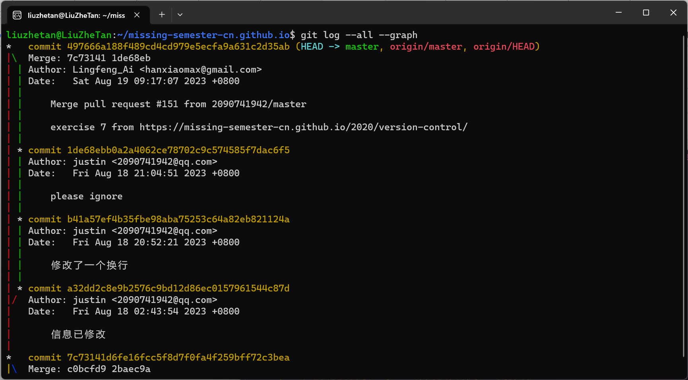
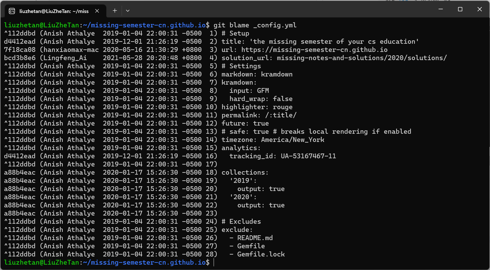
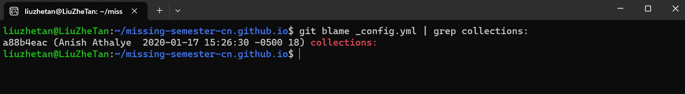
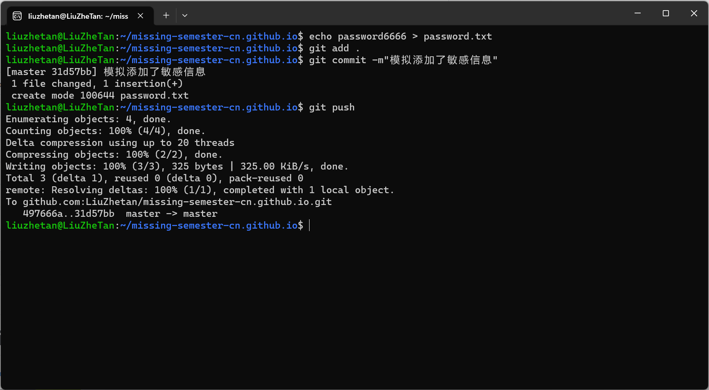
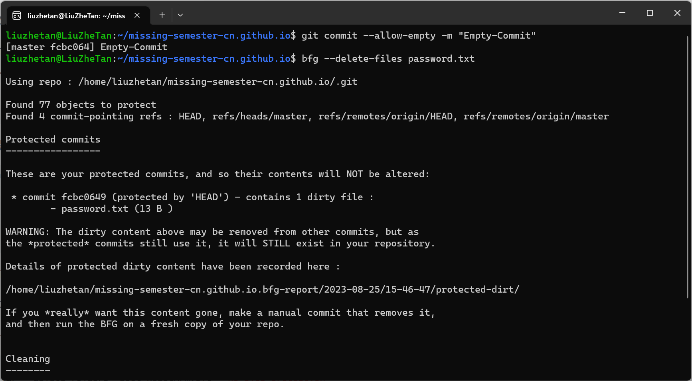
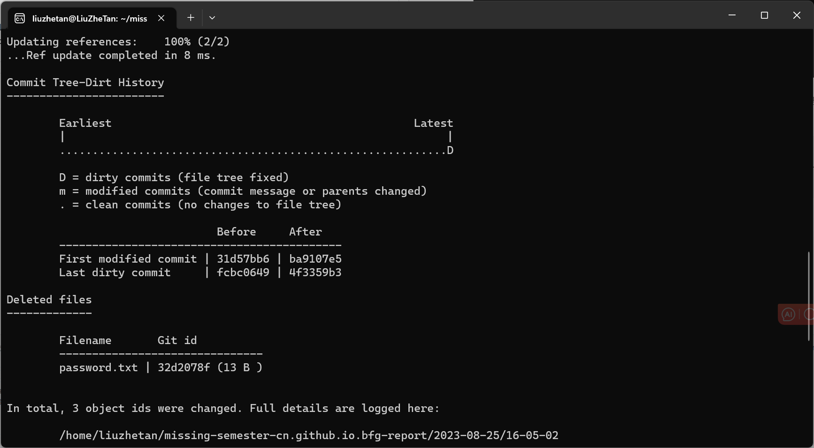
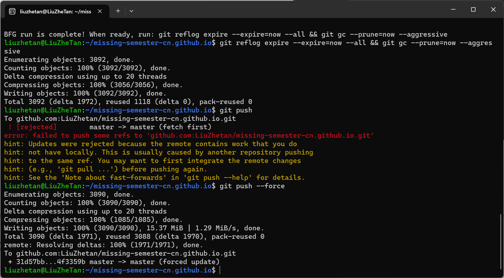
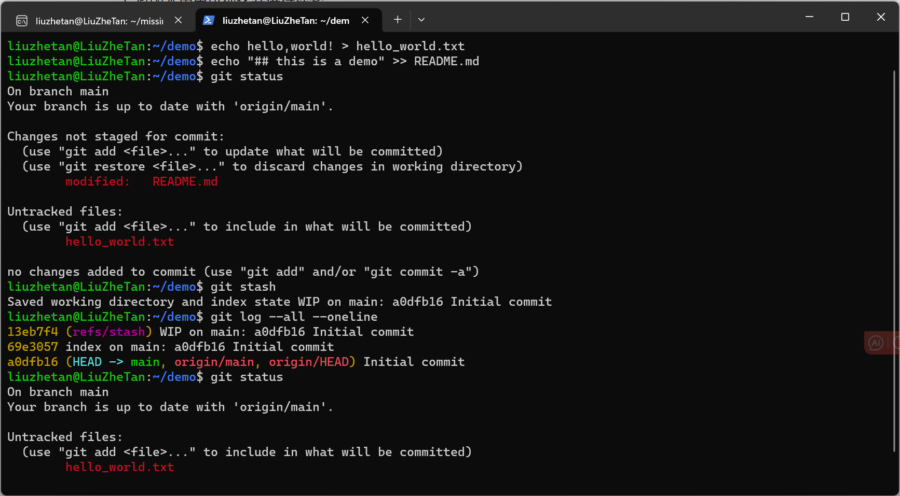
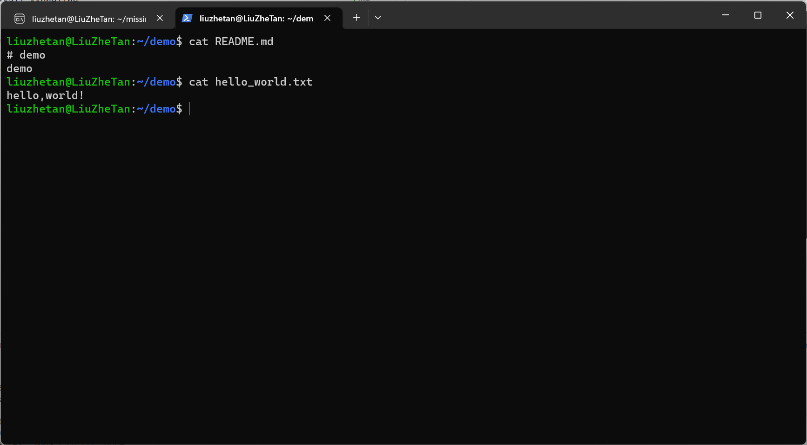
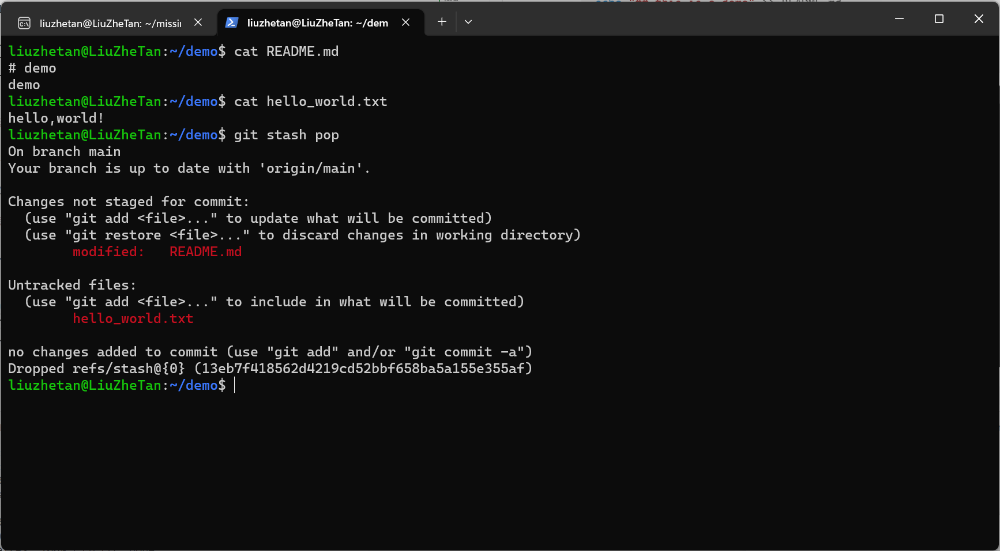

# 版本控制(Git)

1. 如果您之前从来没有用过 Git，推荐您阅读 Pro Git 的前几章，或者完成像 Learn Git Branching这样的教程。重点关注 Git 命令和数据模型相关内容；
2. Fork 本课程网站的仓库
    1. 将版本历史可视化并进行探索

        ```shell
        git log --all --graph
        ```

        

    2. 是谁最后修改了 README.md文件？（提示：使用 git log 命令并添加合适的参数）

        ```shell
        git log -1 README.md
        ```

        

    3. 最后一次修改_config.yml 文件中 collections: 行时的提交信息是什么？（提示：使用 git blame 和 git show）

        ```shell
        # 列出所有的修改情况
        git blame _config.yml
        ```

        

        ```shell
        # 使用grep筛选
        git blame _config.yml | grep collections:
        ```

        

3. 使用 Git 时的一个常见错误是提交本不应该由 Git 管理的大文件，或是将含有敏感信息的文件提交给 Git 。尝试向仓库中添加一个文件并添加提交信息，然后将其从历史中删除 ( 这篇文章也许会有帮助)；

    先模拟创建一个敏感文件，并提交到仓库：

    

    使用[bgf](https://rtyley.github.io/bfg-repo-cleaner/)删除这个文件：

    ```shell
    # 尝试删除文件，无法删除
    bfg --delete-files password.txt 
    ```

    

    这样会有一个问题，这种情况bfg会保护当前版本(HEAD所指的版本)，不去清理，参考这篇[博客](https://www.cnblogs.com/huipengly/p/8424096.html)。这时候需要添加--no-blob-protection，命令如下：

    ```shell
    bfg --delete-files password.txt --no-blob-protection
    git reflog expire --expire=now --all && git gc --prune=now --aggressive
    git push --force
    ```

    

    

4. 从 GitHub 上克隆某个仓库，修改一些文件。当您使用 git stash 会发生什么？当您执行 git log --all --oneline 时会显示什么？通过 git stash pop 命令来撤销 git stash 操作，什么时候会用到这一技巧？

    ```shell
    echo hello,world! > hello_world.txt
    echo "## this is a demo" >> README.md
    git status
    git stash
    git log --all --oneline
    ```

    

    > 可以从git status看到状态退回到了初始状态，但是文件没删除

    再看一下文件内容：

    

    > README.md的内容回退了，hello_world.txt没变

    ```shell
    # 撤销stash
    git stash pop
    ```

    

    关于stash的使用情景，见这篇[博客](https://www.cnblogs.com/tocy/p/git-stash-reference.html).

5. 与其他的命令行工具一样，Git 也提供了一个名为 ~/.gitconfig 配置文件 (或 dotfile)。请在 ~/.gitconfig 中创建一个别名，使您在运行 git graph 时，您可以得到 git log --all --graph --decorate --oneline 的输出结果；

    ```shell
    vim ~/.gitconfig
    ```

    增加以下内容：

    >[alias]\
     graph = log --all --graph --decorate --oneline

6. 您可以通过执行 git config --global core.excludesfile ~/.gitignore_global 在 ~/.gitignore_global 中创建全局忽略规则。配置您的全局 gitignore 文件来自动忽略系统或编辑器的临时文件，例如 .DS_Store

    ```shell
    echo .DS_Store >> .gitignore
    ```
