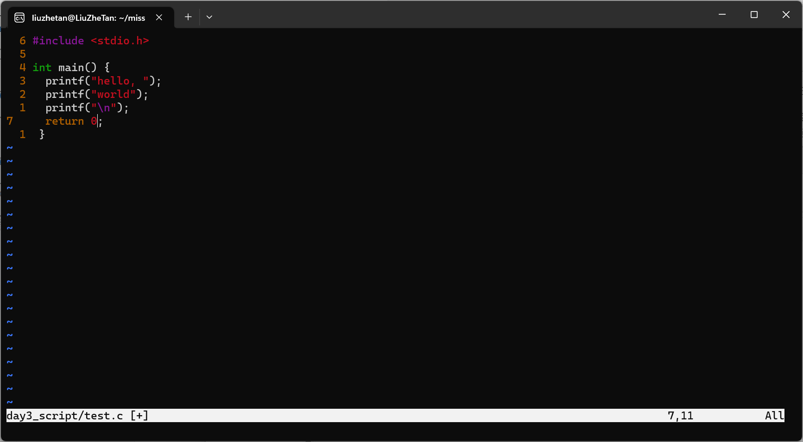
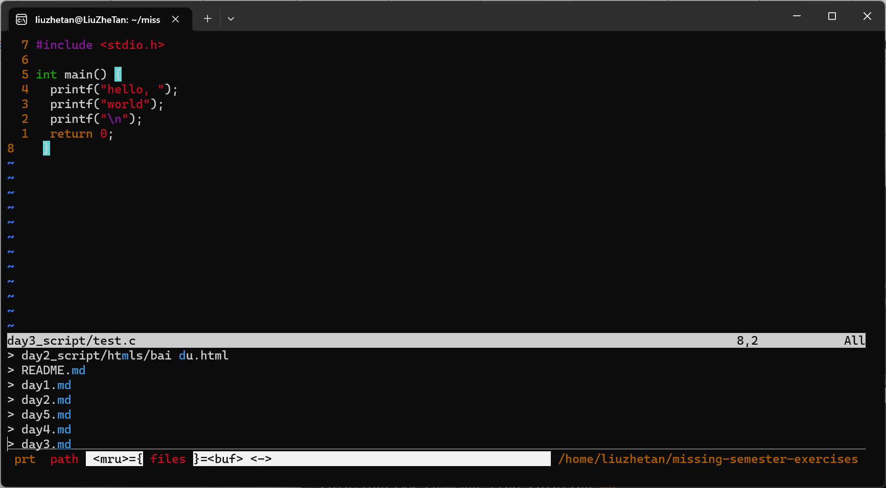
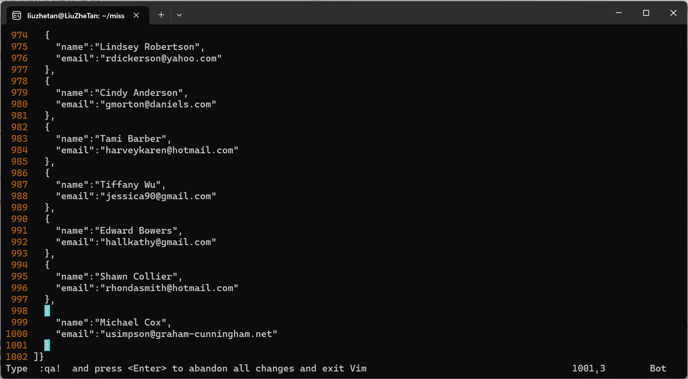

# 编辑器 (Vim)

1. 完成 vimtutor。备注：它在一个 80x24（80 列，24 行） 终端窗口看起来效果最好。
2. 下载我们提供的 vimrc，然后把它保存到 ~/.vimrc。 通读这个注释详细的文件 （用 Vim!）， 然后观察 Vim 在这个新的设置下看起来和使用起来有哪些细微的区别。

    备份原来的vim配置文件

    ```shell
    cp ~/.vimrc day3_script/.vimrc.backup
    ```

    启用新的vim配置文件

    ```shell
    cp day3_script/vimrc ~/.vimrc 
    source ~/.vimrc 
    ```

    随便编辑一个文件

    ```shell
    vim day3_script/test.c
    ```

    效果如下:
    

3. 安装和配置一个插件： ctrlp.vim.

    参考插件[文档](https://github.com/ctrlpvim/ctrlp.vim/blob/master/readme.md)安装和配置

    vim再次打开文件，使用CTRL+P（需要配置）打开CtrlP，输出md查找当前目录下所有的md文件。

    

4. 练习使用 Vim, 在你自己的机器上重做演示。
5. 下个月用 Vim 完成_所有_的文件编辑。每当不够高效的时候，或者你感觉 “一定有一个更好的方式”， 尝试求助搜索引擎，很有可能有一个更好的方式。如果你遇到难题， 来我们的答疑时间或者给我们发邮件。
6. 在你的其他工具中设置 Vim 快捷键 （见上面的操作指南）。
7. 一步自定义你的 ~/.vimrc 和安装更多插件。
8. （高阶）用 Vim 宏将 XML 转换到 JSON (例子文件)。 尝试着先完全自己做，但是在你卡住的时候可以查看上面宏 章节。

    观察xml文件结构，发现本质上是一个“person”条目的数组，person有name和email两个属性，只需要以下步骤即可完成到json文件的转换：

    1. qa录制宏，将第一行和最后一行的people标签去掉
        > ggDI{"people":[\ESC\
        > GDI]}\ESC0xx
    2. 将<person>标签替换为"person":{，将</person>标签替换为}
        > %s/<person>/{/g
        > %s/<\/person>/},/g
    3. 将<name>和<email>标签替换为"name|email":"，将</name>标签替换为",，将</email>标签替换为"
        > %s/<\([a-z]*\)>/"\1":"/g
        > %s/<\/name>/",/g
        > %s/<\/email>/"/g
    4. 删除多余的逗号
        > Gk$x
    5. 保存文件,q结束录制
        > :w! day3_script/example-data.json

    
