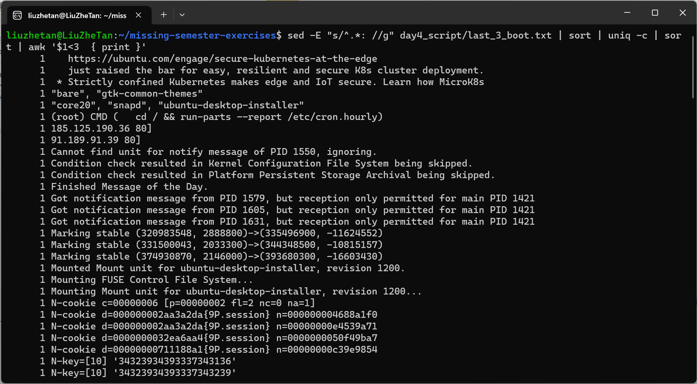

## 数据整理
1. 学习一下这篇简短的交互式正则表达式教程
2. 统计words文件 (/usr/share/dict/words) 中包含至少三个a 且不以's 结尾的单词个数。这些单词中，出现频率前三的末尾两个字母是什么？ sed的 y命令，或者 tr 程序也许可以帮你解决大小写的问题。共存在多少种词尾两字母组合？还有一个很 有挑战性的问题：哪个组合从未出现过？
没有words文件从Wikipedia摘取了[Horry Potter](https://en.wikipedia.org/wiki/Harry_Potter)的介绍文字，存放在harry_potter.txt中。
```
# 统计个数
sed 's/[ .:,]/\n/g' harry_potter.txt \
| grep -E -e '(.*a){3,}' -i \
| grep -E -v "'s$" \
| wc -l
# 统计出现频率最多的三个词
sed 's/[ .:,]/\n/g' harry_potter.txt \
| grep -E -e '(.*a.*){3,}' -i \
| grep -E -v "'s$" \
| sort | uniq -c | sort -rn \
| head -n3
 # 统计出现频率前三多末尾两个字母（参考了解答,使用\1保留后一半识别的模式）
sed 's/[ .:,]/\n/g' harry_potter.txt \
| grep -E -e '(.*a.*){3,}' -i \
| grep -E -v "'s$" \
| sed -E "s/.*([a-z]{2})$/\1/" \
| sort | uniq -c | sort -rn\
| head -n3
# 进阶参考了解答
```
3. 进行原地替换听上去很有诱惑力，例如： sed s/REGEX/SUBSTITUTION/ input.txt > input.txt。但是这并不是一个明智的做法，为什么呢？还是说只有 sed是这样的? 查看 man sed 来完成这个问题。
```
# 随便将text.txt文件中的e字母替换成a
echo hello,world! > text.txt
sed 's/e/a/g' text.txt > text.txt
```
发现text.txt变成空文档了。
查阅文档，sed提供了-i选项原地替换文档
```
# 正确做法
sed -i.bak 's/e/a/g' text.txt
```
4. 找出您最近十次开机的开机时间平均数、中位数和最长时间。在Linux上需要用到 journalctl ，而在 macOS 上使用 log show。找到每次起到开始和结束时的时间戳。在Linux上类似这样操作
> 关于wsl2无法启动systemmctl的[解决方法](https://www.zhihu.com/question/535145130)

使用journalctl查看启动日志：
```
sudo journalctl | grep Startup
```

第一次启动时间不太正常，用了4s，明显长于其他10次，去掉。

```
# 先查找最近10次开机记录(都以ms计时)存放到boot_time文件中
 sudo journalctl \
 | grep "Startup finished in" \
 | grep -E -e 'ms\.$' \
 | sed 's/^.*Startup finished in //g' \
 | sed 's/ms\.//g' \
 | sort -rn \
 | head -n 10 > ./day4_script/boot_time
 # 然后运行awk脚本
 awk -f ./day4_script/cal.awk ./day4_script/boot_time
```
运行结果：


5. 查看之前三次重启启动信息中不同的部分(参见 journalctl的-b 选项)。将这一任务分为几个步骤，首先获取之前三次启动的启动日志，也许获取启动日志的命令就有合适的选项可以帮助您提取前三次启动的日志，亦或者您可以使用sed '0,/STRING/d' 来删除STRING匹配到的字符串前面的全部内容。然后，过滤掉每次都不相同的部分，例如时间戳。下一步，重复记录输入行并对其计数(可以使用uniq )。最后，删除所有出现过3次的内容（因为这些内容是三次启动日志中的重复部分）。
```
# 首先执行脚本获取最近3次启动记录
./day4_script/last_3_boot.sh
# sed一定要加-E选项指明使用extended regular expressions
sed -E "s/^.*: //g" day4_script/last_3_boot.txt \
| sort | uniq -c | sort \
| awk '$1<3  { print }'
```
>首先 sed -E "s/^.*: //g" day4_script/last_3_boot.txt去掉时间戳和输出来源信息，这部分每次都不同。然后排序，使用awk筛选输出。


6. 在网上找一个类似 这个 或者这个的数据集。或者从这里找一些。使用 curl 获取数据集并提取其中两列数据，如果您想要获取的是HTML数据，那么pup可能会更有帮助。对于JSON类型的数据，可以试试jq。请使用一条指令来找出其中一列的最大值和最小值，用另外一条指令计算两列之间差的总和。
```
# 以第二个网站为例
curl -s https://ucr.fbi.gov/crime-in-the-u.s/2016/crime-in-the-u.s.-2016/topic-pages/tables/table-1 > ./day4_script/FIB.html
# 生成表单格式的数据,其中null使用0填充
pup -f ./day4_script/FIB.html 'tbody json{}' \
| jq '.[0].children | .[] | [.children[].text]' \
| sed 's/null/0/g' | sed -E -e 's/[^0-9.]//g' \
| sed -z -E 's/\n/ /g;s/^ //;s/ $/\n/' \
| sed -E 's/ {3}/\n/g' > ./day4_script/FBI.txt
# 最后使用awk统计
# 计算第2列的最大值和最小值
awk -f ./day4_script/max_min.awk ./day4_script/FBI.txt
# 计算两列差之总和
awk '{sum+=$2-$3} END {printf "SUM:%d\n",sum}' ./day4_script/FBI.txt
```
>注意:sed需要-z选项才能删除换行符号
