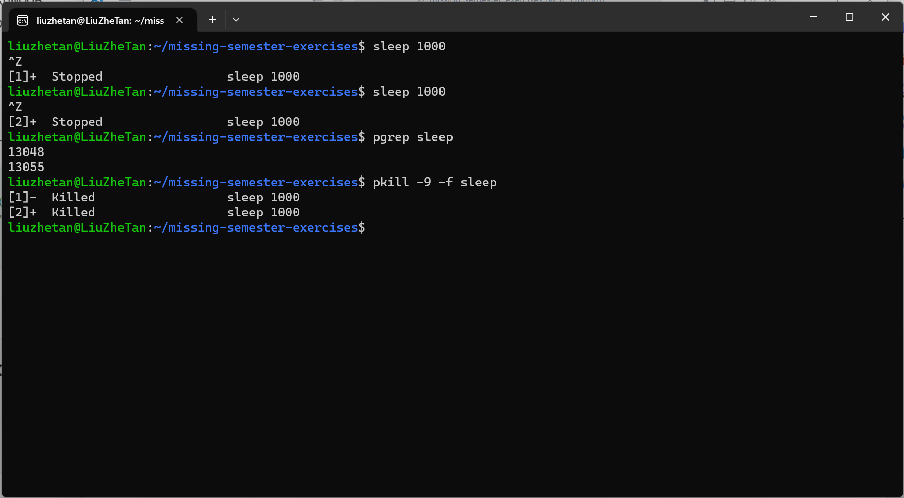
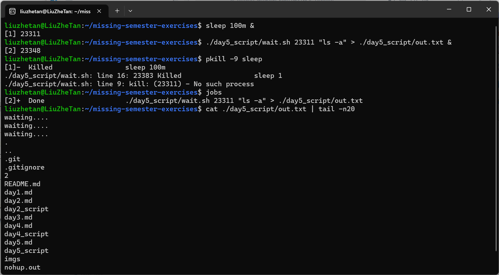
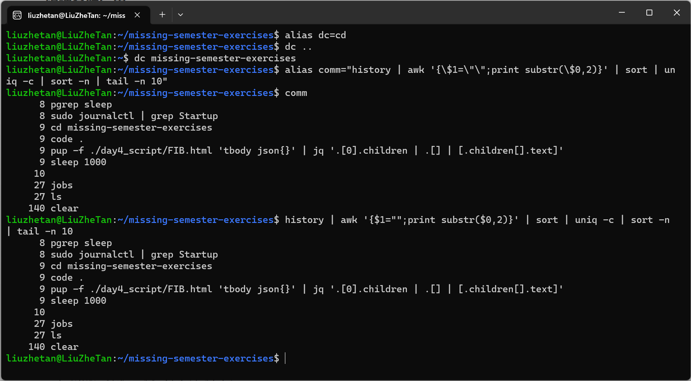

# 命令行环境

## 任务控制

1. 我们可以使用类似 ps aux | grep 这样的命令来获取任务的 pid ，然后您可以基于pid 来结束这些进程。但我们其实有更好的方法来做这件事。在终端中执行 sleep 10000 这个任务。然后用 Ctrl-Z 将其切换到后台并使用 bg来继续允许它。现在，使用 pgrep 来查找 pid 并使用 pkill 结束进程而不需要手动输入pid。(提示：: 使用 -af 标记)。

    ```shell
    # 多创建几个sleep进程
    sleep 1000
    # 显示所有的sleep进程
    $pgrep sleep
    # 删除所有的sleep进程
    pkill -9 -f sleep
    ```

    

2. 如果您希望某个进程结束后再开始另外一个进程， 应该如何实现呢？在这个练习中，我们使用 sleep 60 & 作为先执行的程序。一种方法是使用 wait 命令。尝试启动这个休眠命令，然后待其结束后再执行 ls 命令。但是，如果我们在不同的 bash 会话中进行操作，则上述方法就不起作用了。因为 wait 只能对子进程起作用。之前我们没有提过的一个特性是，kill 命令成功退出时其状态码为 0 ，其他状态则是非0。kill -0 则不会发送信号，但是会在进程不存在时返回一个不为0的状态码。请编写一个 bash 函数 pidwait ，它接受一个 pid 作为输入参数，然后一直等待直到该进程结束。您需要使用 sleep 来避免浪费 CPU 性能。

    >脚本“./day5_script/wait.sh”接收两个参数，第一个是需要等到的进程的pid，第二个是要启动的命令或脚本(使用eval命令启动)。

    创建一个sleep进程然后执行"ls -a"程序，将输出重定向到"day5_script/out.txt"文件中。

    

## 终端多路复用

1. 请完成这个 tmux 教程 参考这些步骤来学习如何自定义 tmux。

## 别名

1. 创建一个 dc 别名，它的功能是当我们错误的将 cd 输入为 dc 时也能正确执行。
2. 执行 history | awk '{$1="";print substr($0,2)}' | sort | uniq -c | sort -n | tail -n 10 来获取您最常用的十条命令，尝试为它们创建别名。注意：这个命令只在 Bash 中生效，如果您使用 ZSH，使用history 1 替换 history。

    ```shell
    # 创建dc别名
    alias dc=cd
    # 创建comm别名,注意$和“要使用转义符
    alias comm="history | awk '{\$1=\"\";print substr(\$0,2)}' | sort | uniq -c | sort -n | tail -n 10"
    ```

    
