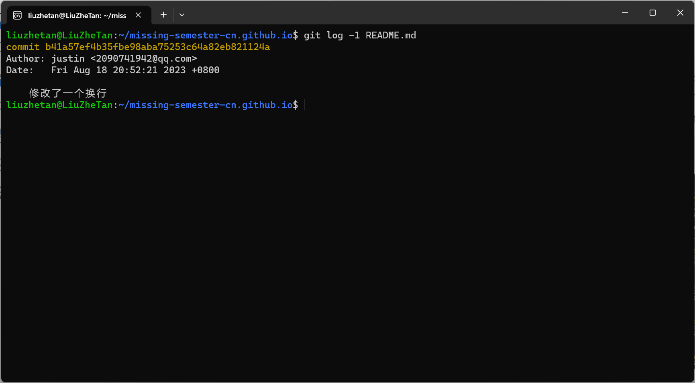

# 版本控制(Git)

1. 如果您之前从来没有用过 Git，推荐您阅读 Pro Git 的前几章，或者完成像 Learn Git Branching这样的教程。重点关注 Git 命令和数据模型相关内容；
2. Fork 本课程网站的仓库
    1. 将版本历史可视化并进行探索

        ```shell
        git log --all --graph
        ```

        

    2. 是谁最后修改了 README.md文件？（提示：使用 git log 命令并添加合适的参数）

        ```shell
        git log -1 README.md
        ```

        

    3. 最后一次修改_config.yml 文件中 collections: 行时的提交信息是什么？（提示：使用 git blame 和 git show）
