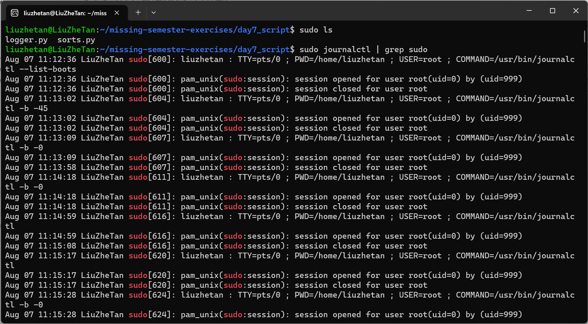
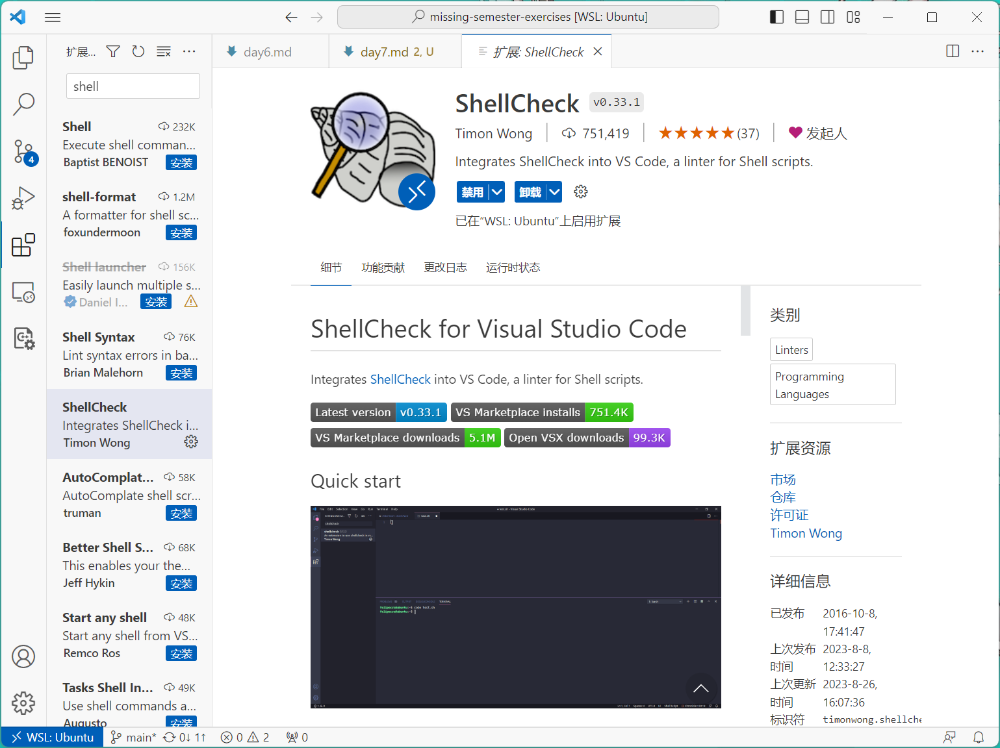
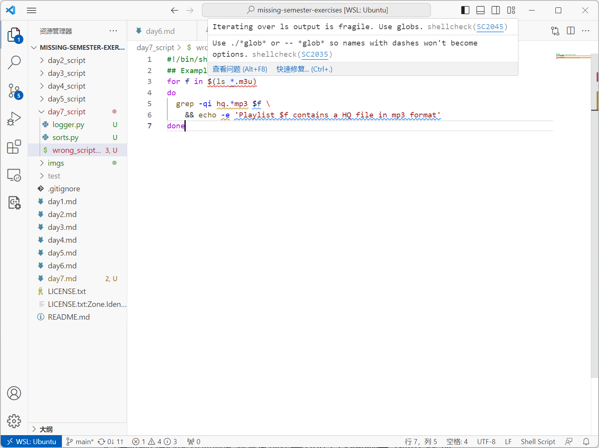
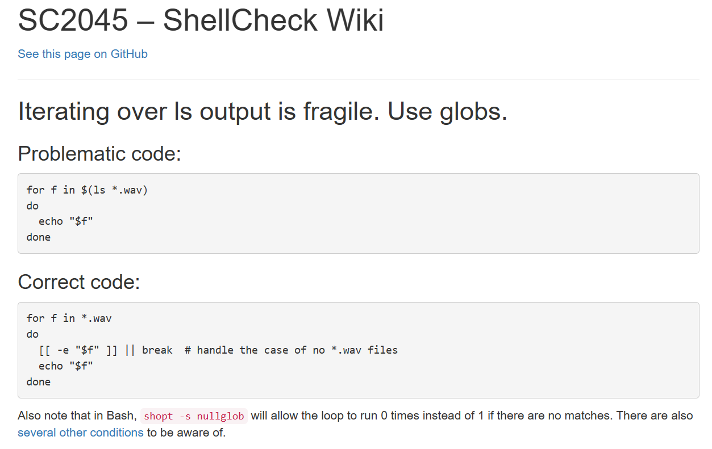
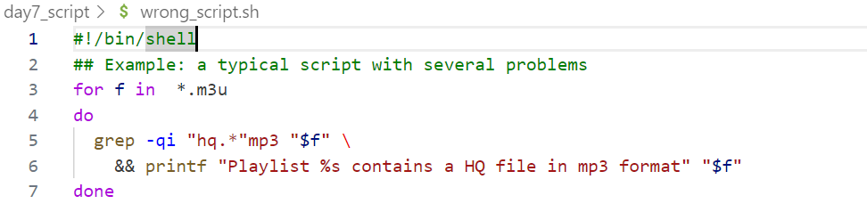
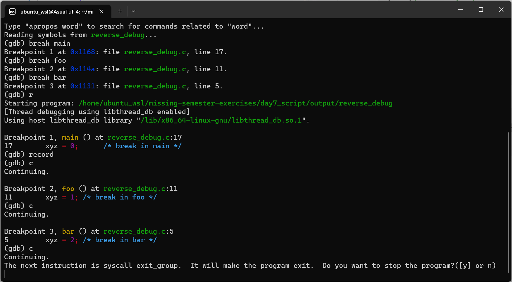
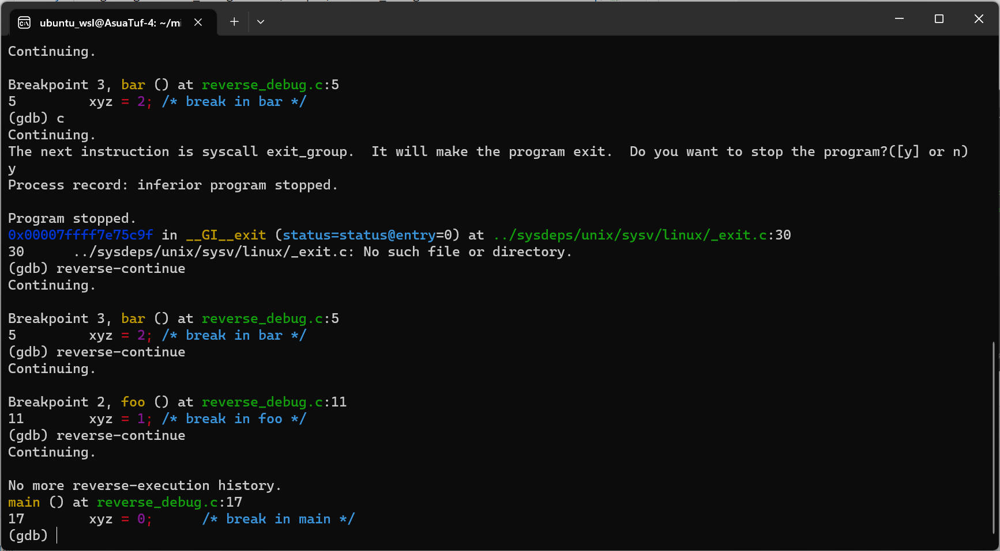
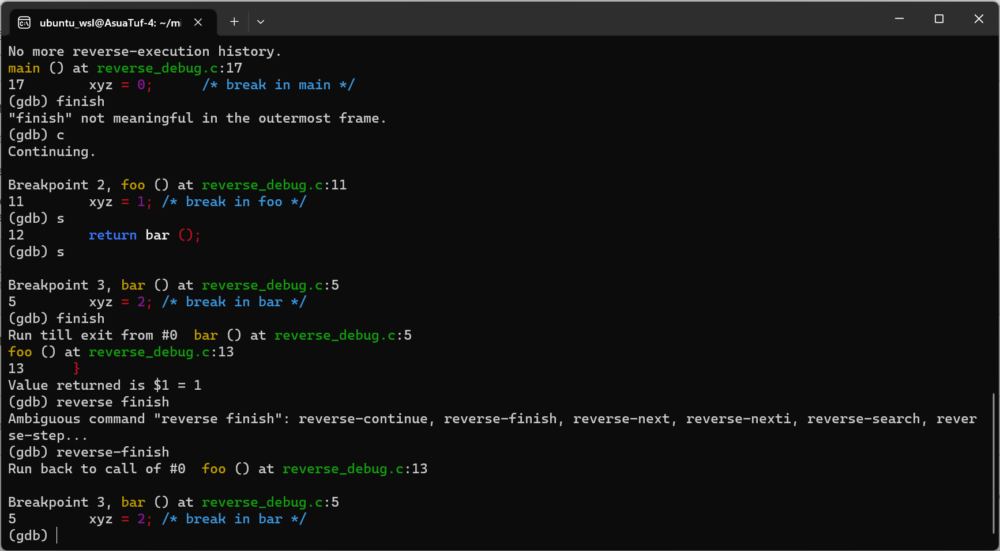

# 调试与性能分析

## 调试

1. 使用 Linux 上的 journalctl 或 macOS 上的 log show 命令来获取最近一天中超级用户的登录信息及其所执行的指令。如果找不到相关信息，您可以执行一些无害的命令，例如sudo ls 然后再次查看。 这里我在树莓派上查询相关日志

    ```shell
        sudo journalctl | grep sudo
    ```

    

2. 学习 这份 pdb 实践教程并熟悉相关的命令。更深入的信息您可以参考这份教程。

3. 安装 shellcheck 并尝试对下面的脚本进行检查。这段代码有什么问题吗？请修复相关问题。在您的编辑器中安装一个linter插件，这样它就可以自动地显示相关警告信息。

    ```shell
    #!/bin/sh
    ## Example: a typical script with several problems
    for f in $(ls *.m3u)
    do
    grep -qi hq.*mp3 $f \
        && echo -e 'Playlist $f contains a HQ file in mp3 format'
    done
    ```

    在vscode上安装ShellCheck:

    

    检查脚本,发现第3行有错误:

    

    查看错误链接，示范了正确写法:

    

    修改后NO Error and No Warn：

    ```shell
    #!/bin/shell
    ## Example: a typical script with several problems
    for f in  *.m3u
    do
    grep -qi "hq.*"mp3 "$f" \
        && printf "Playlist %s contains a HQ file in mp3 format" "$f"
    done
    ```

    

4. (进阶题) 请阅读 可逆调试 并尝试创建一个可以工作的例子（使用 rr 或 RevPDB）。此外，GDB也自带reverse debugging功能，参考这篇[教程](https://www.sourceware.org/gdb/wiki/ProcessRecord/Tutorial)和这份[文档](https://sourceware.org/gdb/onlinedocs/gdb/Reverse-Execution.html)以及[官方文档](https://www.sourceware.org/gdb/news/reversible.html)

    参考这个例子:
    ```C
    int xyz;

    int bar ()
    {
    xyz = 2; /* break in bar */
    return 1;
    }

    int foo ()
    {
    xyz = 1; /* break in foo */
    return bar ();
    }

    int main ()
    {
    xyz = 0;      /* break in main */
    foo ();
    return (xyz == 2 ? 0 : 1);
    }               /* end of main */
    ```

    调试上述例子
    ```shell
    cd day7_script
    gcc -g reverse_debug.c -o ./output/reverse_debug
    cd ./output
    gdb reverse_debug
    ```

    设置断点，运行:

    

    reverse-continue:

    

    finish和reverse-finish:

    

    >注意：gdb的reocrd支持的指令有限（例如如果有getchar函数就不能record），且支持的架构有限。
