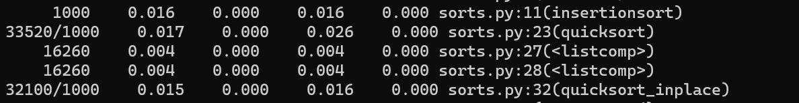
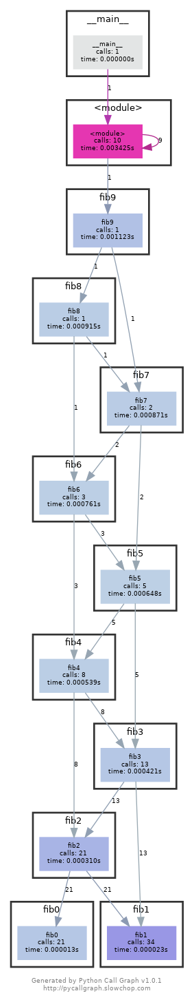
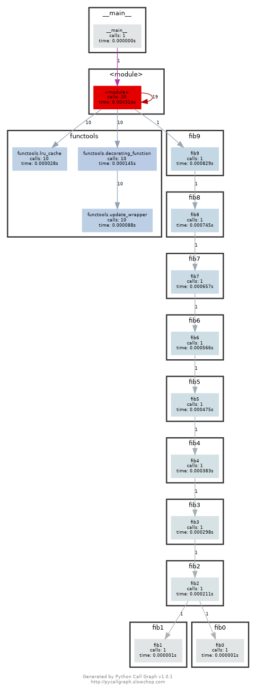
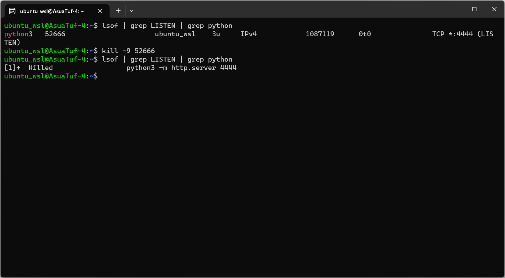
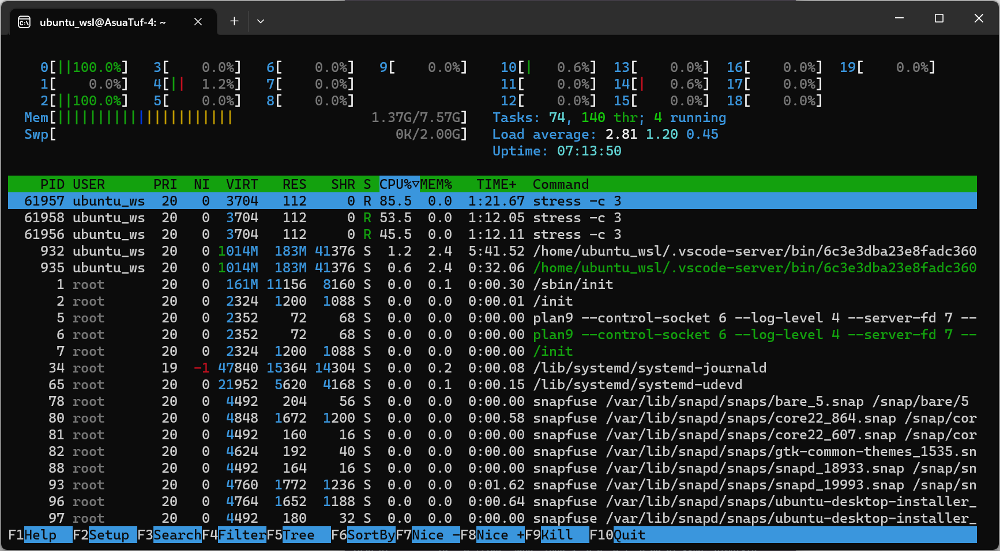
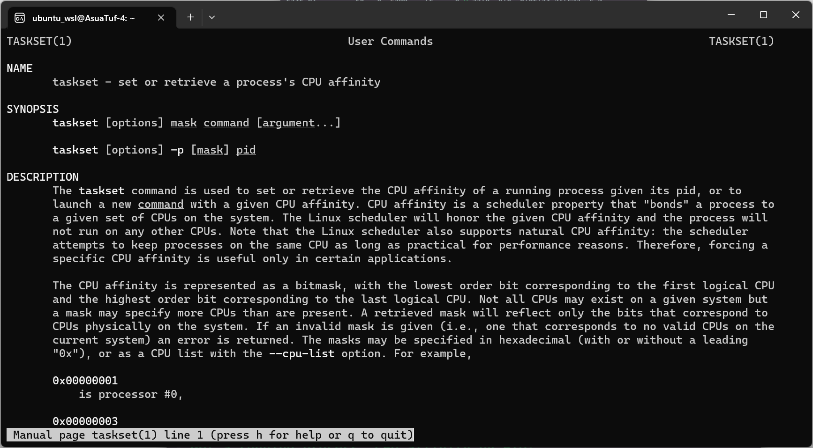
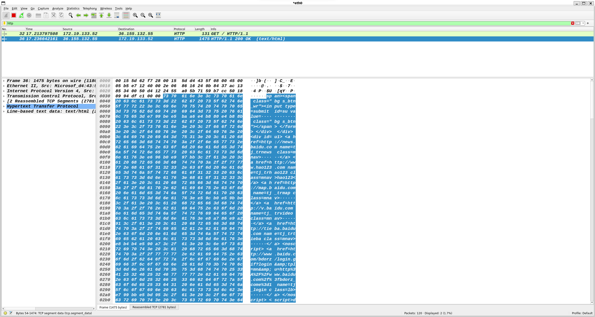

# 调试与性能分析

## 调试

1. 使用 Linux 上的 journalctl 或 macOS 上的 log show 命令来获取最近一天中超级用户的登录信息及其所执行的指令。如果找不到相关信息，您可以执行一些无害的命令，例如sudo ls 然后再次查看。 这里我在树莓派上查询相关日志

    ```shell
        sudo journalctl | grep sudo
    ```

    

2. 学习 这份 pdb 实践教程并熟悉相关的命令。更深入的信息您可以参考这份教程。

3. 安装 shellcheck 并尝试对下面的脚本进行检查。这段代码有什么问题吗？请修复相关问题。在您的编辑器中安装一个linter插件，这样它就可以自动地显示相关警告信息。

    ```shell
    #!/bin/sh
    ## Example: a typical script with several problems
    for f in $(ls *.m3u)
    do
    grep -qi hq.*mp3 $f \
        && echo -e 'Playlist $f contains a HQ file in mp3 format'
    done
    ```

    在vscode上安装ShellCheck:

    

    检查脚本,发现第3行有错误:

    

    查看错误链接，示范了正确写法:

    

    修改后NO Error and No Warn：

    ```shell
    #!/bin/shell
    ## Example: a typical script with several problems
    for f in  *.m3u
    do
    grep -qi "hq.*"mp3 "$f" \
        && printf "Playlist %s contains a HQ file in mp3 format" "$f"
    done
    ```

    

4. (进阶题) 请阅读 可逆调试 并尝试创建一个可以工作的例子（使用 rr 或 RevPDB）。此外，GDB也自带reverse debugging功能，参考这篇[教程](https://www.sourceware.org/gdb/wiki/ProcessRecord/Tutorial)和这份[文档](https://sourceware.org/gdb/onlinedocs/gdb/Reverse-Execution.html)以及[官方文档](https://www.sourceware.org/gdb/news/reversible.html)

    参考这个例子:
    ```C
    int xyz;

    int bar ()
    {
    xyz = 2; /* break in bar */
    return 1;
    }

    int foo ()
    {
    xyz = 1; /* break in foo */
    return bar ();
    }

    int main ()
    {
    xyz = 0;      /* break in main */
    foo ();
    return (xyz == 2 ? 0 : 1);
    }               /* end of main */
    ```

    调试上述例子
    ```shell
    cd day7_script
    gcc -g reverse_debug.c -o ./output/reverse_debug
    cd ./output
    gdb reverse_debug
    ```

    设置断点，运行:

    

    reverse-continue:

    
kv
    finish和reverse-finish:

    

    >注意：gdb的reocrd支持的指令有限（例如如果有getchar函数就不能record），且支持的架构有限。

## 性能分析

1. [这里](./day7_script/sorts.py)有一些排序算法的实现。请使用 cProfile 和 line_profiler 来比较插入排序和快速排序的性能。两种算法的瓶颈分别在哪里？然后使用 memory_profiler 来检查内存消耗，为什么插入排序更好一些？然后再看看原地排序版本的快排。附加题：使用 perf 来查看不同算法的循环次数及缓存命中及丢失情况。

    ```shell
    # use cProfile
    cd day7_script
    python -m cProfile sorts.py
    ```

    排序函数测试部分,表头依次是ncalls，tottime，percall，cumtime，percall filename:lineno(function)，表头含义参考[官方文档](https://docs.python.org/3/library/profile.html)，其中tottime是不好含函数调用子函数的运行时间，而cumtime是函数包含了其他子函数的运行时间:

    

    普通的快速排序比插入排序还要慢，很大一部分原因是在quicksort在27和28使用了列表遍历操作，这是一个相当费时的操作，而原地快速排序去掉了这个操作但是代码复杂，没有普通的快速排序简洁。

    ```shell
    # use line_rrofile
    sudo apt install python3-line-profiler
    # 先得修改sorts.py
    # 导入包：from line_profiler import profile
    # 在需要测试的函数前加@profile修饰
    # @profile
    # def insertionsort(array):
    kernprof -l -v sorts.py

    # use memory_profile
    pip install memory_profiler
    # 同样导入包并使用@profile修饰修饰测试函数
    python -m memory_profiler sorts.py
    ```

    测试每次调用insertionsort、quicksort、quicksort_inplace的使用内存分别为：20.3MiB、20.4MiB、20.2MiB

    > perf暂时不支持WSL2

2. [这里](./day7_script/fib.py)有一些用于计算斐波那契数列 Python 代码，它为计算每个数字都定义了一个函数，将代码拷贝到文件中使其变为一个可执行的程序。首先安装 pycallgraph和graphviz(如果您能够执行dot, 则说明已经安装了 GraphViz.)。并使用 pycallgraph graphviz -- ./fib.py 来执行代码并查看pycallgraph.png 这个文件。fib0 被调用了多少次？我们可以通过记忆法来对其进行优化。将注释掉的部分放开，然后重新生成图片。这回每个fibN 函数被调用了多少次？

    ```shell
    sudo apt install python3-pycallgraph
    pycallgraph graphviz -- ./fib.py
    ```

    不展开注释：

    

    展开注释，减少调用次数：

    

3. 我们经常会遇到的情况是某个我们希望去监听的端口已经被其他进程占用了。让我们通过进程的PID查找相应的进程。首先执行 python -m http.server 4444 启动一个最简单的 web 服务器来监听 4444 端口。在另外一个终端中，执行 lsof | grep LISTEN 打印出所有监听端口的进程及相应的端口。找到对应的 PID 然后使用 kill <PID> 停止该进程。

    

4. 限制进程资源也是一个非常有用的技术。执行 stress -c 3 并使用htop 对 CPU 消耗进行可视化。现在，执行taskset --cpu-list 0,2 stress -c 3 并可视化。stress 占用了3个 CPU 吗？为什么没有？阅读man taskset来寻找答案。附加题：使用 cgroups来实现相同的操作，限制stress -m的内存使用。

    ```shell
    taskset --cpu-list 0,2 stress -c 3 &
    htop
    ```

    

    20个cpu只有两个占满了，查看taskset的手册：

    ```shell
    man taskset
    ```

    

    taskset命令用于设置或检索给定pid的正在运行进程的CPU亲和度，CPU亲和性是一种调度器属性，它将进程“绑定”到系统上的一组给定CPU。Linux调度器将遵循给定的CPU亲和性，并且进程不会在任何其他CPU上运行。请注意，Linux调度器还支持自然的CPU亲缘性:调度器会尽可能地将进程保持在同一个CPU上，这是出于性能考虑。因此，强制特定的CPU关联仅在某些应用程序中有用

    > 问题：cgroup-bin无法安装

5. (进阶题) curl ipinfo.io 命令或执行 HTTP 请求并获取关于您 IP 的信息。打开 Wireshark 并抓取 curl 发起的请求和收到的回复报文

    Ubuntu安装wireshark，参考这篇[文章](https://zhuanlan.zhihu.com/p/112649281)

    ```shell
    sudo add-apt-repository ppa:wireshark-dev/stable
    sudo apt update
    sudo apt install wireshark
    ```

    使用curl发送一个包

    ```shell
    curl www.baidu.com
    ```

    在wireshark中监听以太网，并使用http过滤

    

    
